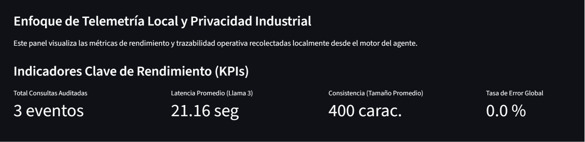
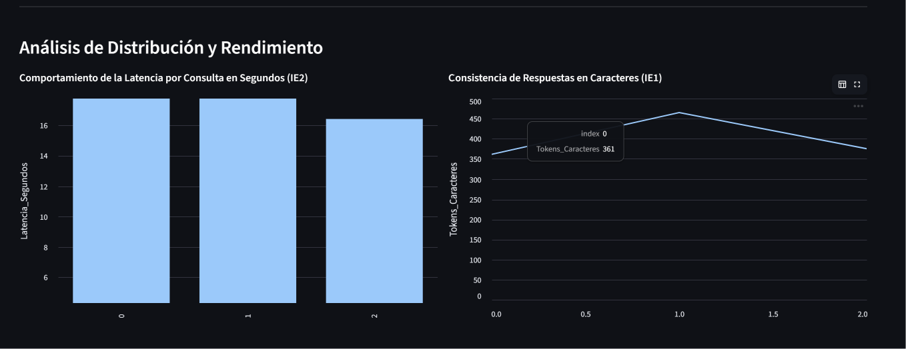
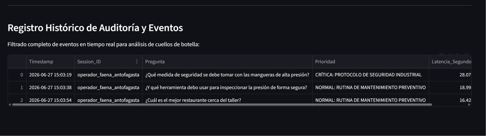

# 📊 Monitoreo y Observabilidad - 
**Duoc UC -  Ingeniería de Soluciones con IA **

En esta tercera entrega, implementamos un módulo de observabilidad y telemetría sobre el agente RAG local. Desarrollamos un sistema automático que registra las métricas de rendimiento en un archivo CSV (`registro_ejecucion.csv`) y creamos un panel visual interactivo con **Streamlit** (`dashboard.py`) para monitorear en tiempo real la latencia, la consistencia de caracteres y los estados de error del modelo Llama 3.

---

## 📈 Evidencias del Dashboard en Tiempo Real

A continuación se exponen las capturas de pantalla correspondientes al funcionamiento del panel analítico:

### 1. Indicadores Clave de Rendimiento (KPIs)

### 2. Análisis de Distribución y Consistencia de Respuestas

### 3. Registro Histórico de Auditoría y Eventos (Logs)

